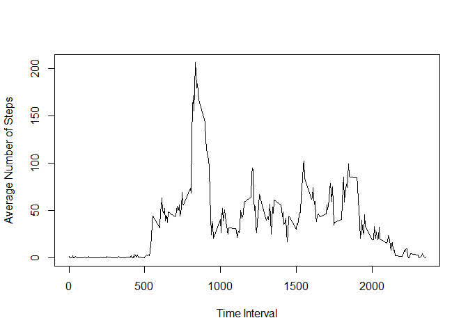

# Reproducible Research: Peer Assessment 1

Professor Peng provided template with title and subtitles only.
I modified the template by inserting the code needed to perform 
the operations indicated by the subtitles, as well as inserting 
comments explaining the operations performed.

## Loading and preprocessing the data
Data contained in zipped file manually downloaded 28-Aug-2016 
into the current directory from the course web site. The url 
for the original data follows.

      https://d396qusza40orc.cloudfront.net/repdata%2Fdata%2Factivity.zip

Reading data and converting strings to dates:


```r
activity <- read.csv(unzip('repdata%2Fdata%2Factivity.zip'), 
                     stringsAsFactors = FALSE)
activity$date <- as.Date(activity$date, '%Y-%m-%d' )
```


## What is mean total number of steps taken per day?

### Calculate total daily steps ignoring missing values in data set.

```r
library(dplyr)
```

```
## 
## Attaching package: 'dplyr'
```

```
## The following objects are masked from 'package:stats':
## 
##     filter, lag
```

```
## The following objects are masked from 'package:base':
## 
##     intersect, setdiff, setequal, union
```

```r
byday <- group_by(activity, date)
daily_steps <- summarize(byday, steps=sum(steps, na.rm = TRUE))
```

### Plot histogram of total daily steps.

```r
library(ggplot2)
p <- qplot(steps, data = daily_steps, geom = 'histogram', binwidth = 2120,
           xlab='Total Daily Steps', ylab='Number of Days')
print(p)
```

<!-- -->

### Calculate the mean and the median of total daily steps.


```r
zmean <- mean(daily_steps$steps, na.rm = TRUE)
zmedian <- median(daily_steps$steps, na.rm = TRUE)
```
      mean = 9354.2295082
      median = 10395

## What is the average daily activity pattern?

### Calculate average steps for each interval across all days.

```r
byint <- group_by(activity, interval)
interval_steps <- summarize(byint, steps=mean(steps, na.rm = TRUE))
```

### Plot time series of average steps by interval.

```r
plot(interval_steps$interval, 
          interval_steps$steps, 
          type = 'l', xlab='Time Interval', 
          ylab='Average Number of Steps')
```

<!-- -->

### Time interval with highest average of steps across all days.

```r
m <- which.max(interval_steps$steps)
interval_max <- interval_steps$interval[m]
```
The time interval with highest average steps is: 835

## Imputing missing values

### Total number of missing values in the data set

```r
steps_miss <- sum(is.na(activity$steps))
date_miss <- sum(is.na(activity$date))
interval_miss <- sum(is.na(activity$interval))
```
      steps:      2304
      date:       0
      interval:   0

### Impute interval mean across all days to intervals with missing step count
If steps in activity table are missing for a given time interal on a given day, then
impute the mean calculated above for that five-minute interval. 

```r
activity_i <- inner_join(activity, interval_steps, by='interval')
activity_i$steps <- with(activity_i, ifelse(is.na(steps.x), steps.y, steps.x ))
activity_i <- select(activity_i, steps, date, interval)
```

### Calculate total daily steps with imputed values in data set.

```r
byday_i <- group_by(activity_i, date)
daily_steps_i <- summarize(byday_i, steps=sum(steps, na.rm = TRUE))
```

### Plot histogram of total daily steps with imputed data.

```r
p <- qplot(steps, data = daily_steps_i, geom = 'histogram', binwidth = 2120,
           xlab='Total Daily Steps', ylab='Number of Days')
print(p)
```

<!-- -->

### Calculate the mean and the median of total daily steps with imputed data.


```r
zmean_i <- format(mean(daily_steps_i$steps), digits = 7)
zmedian_i <- format(median(daily_steps_i$steps), digist = 7)
```
      mean = 10766.19
      median = 10766.19

The effect of the imputed values is an increase in the mean and the median.


## Are there differences in activity patterns between weekdays and weekends?

### Determine which dates fall on weekdays and which fall on weekends.

```r
activity_i$day <- weekdays(activity_i$date, abbreviate = TRUE)
activity_i$daytype <- factor(ifelse(activity_i$day %in% c('Sat','Sun'), 'Weekend', 'Weekday'))
```

### Calculate average steps for each interval for weekdays and weekends.

```r
byint_ww <- group_by(activity_i, interval, daytype)
interval_steps_ww <- summarize(byint_ww, steps=mean(steps, na.rm = TRUE))
```

### Plot time series of average steps by interval for weekdays and weekends.

```r
library(lattice)
xyplot(steps ~ interval | daytype, data=interval_steps_ww, type='l', layout=c(1,2),
           xlab='Time Interval', ylab='Average Number of Steps') 
```

<!-- -->
